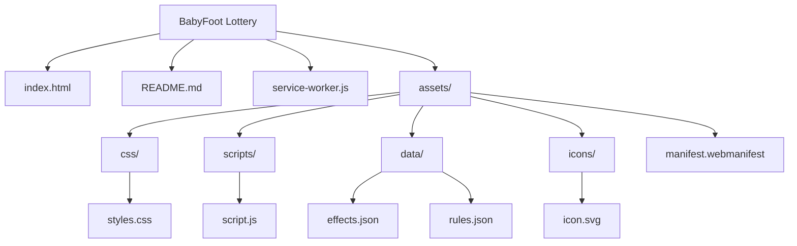

# BabyFoot Lottery

🎯 **BabyFoot Lottery** - Une roue de loterie pour pimenter vos matchs de babyfoot.

## Pourquoi ce projet ?

BabyFoot Lottery est une application web statique qui affiche une roue d'effets. On clique, la roue tourne, et l'effet tiré s'applique a la table. Tout est simple a heberger et a personnaliser.

## Fonctionnalites

- 🎡 Roue interactive en Canvas avec animation fluide
- 🎯 Effets pondérés (plus la valeur est basse, plus c'est rare)
- ✨ Badges Rare / Legendaire selon la ponderation
- ⚡ Affichage de duree en nombre de buts pour chaque effet
- 📱 Interface responsive et utilisable sur mobile
- 🧩 Configuration facile via JSON
- 📦 PWA avec cache offline via service worker

## Demarrage rapide

### Option 1 : ouverture directe

Vous pouvez ouvrir [index.html](index.html) directement dans le navigateur. Certaines fonctions (comme le chargement JSON) peuvent toutefois necessiter un serveur local selon le navigateur.

### Option 2 : serveur local (recommande)

```bash
# Python
python -m http.server 8000

# Node.js
npx http-server -p 8000
```

Ouvrez ensuite `http://localhost:8000`.

## Utilisation

- Cliquez sur la roue pour la faire tourner.
- Appuyez sur `Entree` pour lancer un spin.
- Le resultat affiche le nom de l'effet, sa description et sa duree (en nombre de buts).

## Configuration des effets

Tout se passe dans [assets/data/effects.json](assets/data/effects.json).

Exemple :

```json
{
  "effects": [
    {
      "id": 17,
      "name": "Votre effet",
      "description": "Description de l'effet",
      "color": "#FF5733",
      "goalsRequired": 1,
      "weight": 10
    }
  ]
}
```

Champs disponibles :

- `id` : identifiant unique (nombre)
- `name` : nom affiche dans la roue
- `description` : ce que l'effet implique
- `color` : couleur de segment (hex)
- `goalsRequired` : nombre de buts pendant lequel l'effet reste actif
- `weight` : probabilite (plus petit = plus rare)

Rareté :

- `weight` == 1 : No Wayyy
- `weight` == 2 : Légendaire
- `weight` <= 5 : Rare
- `weight` > 5 : Commun

## Structure du projet

- [index.html](index.html) : page principale
- [assets/css/styles.css](assets/css/styles.css) : styles et animations
- [assets/scripts/script.js](assets/scripts/script.js) : logique de la roue et animations
- [assets/data/effects.json](assets/data/effects.json) : liste et ponderation des effets
- [assets/data/rules.json](assets/data/rules.json) : regles additionnelles
- [service-worker.js](service-worker.js) : cache offline
- [assets/manifest.webmanifest](assets/manifest.webmanifest) : metadonnees PWA

Architecture :



## Contribuer

Toute aide est bienvenue ! Voici un flux simple :

1. Forkez le repo.
2. Creez une branche (`git checkout -b feature/ma-modif`).
3. Faites vos changements.
4. Testez en local.
5. Ouvrez une Pull Request.

Idees de contribution :

- Ajouter de nouveaux effets
- Ameliorer les animations
- Proposer des regles additionnelles
- Ameliorer l'accessibilite
- Ajouter des tests simples ou du linting

## Support

Si vous avez une idee ou un bug, ouvrez une issue :
https://github.com/EAnathos/BabyFoot-Lottery/issues

Bon match ! 🏆